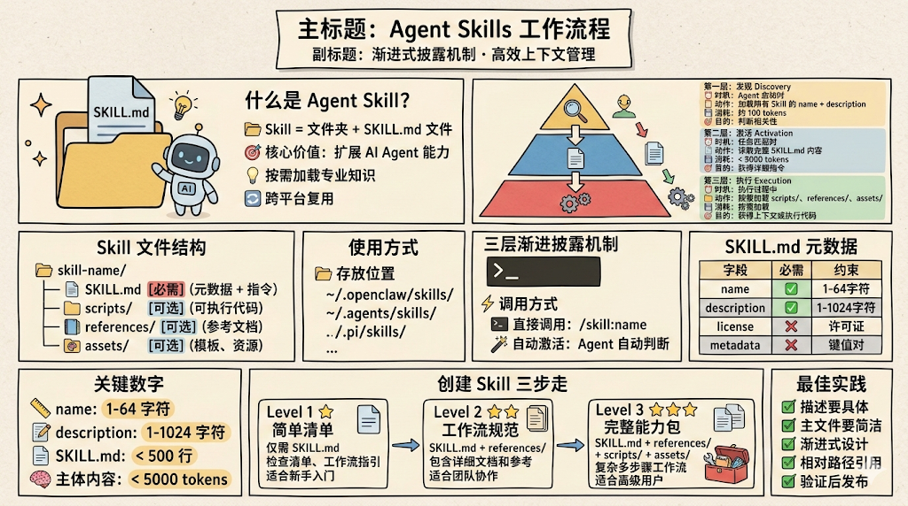
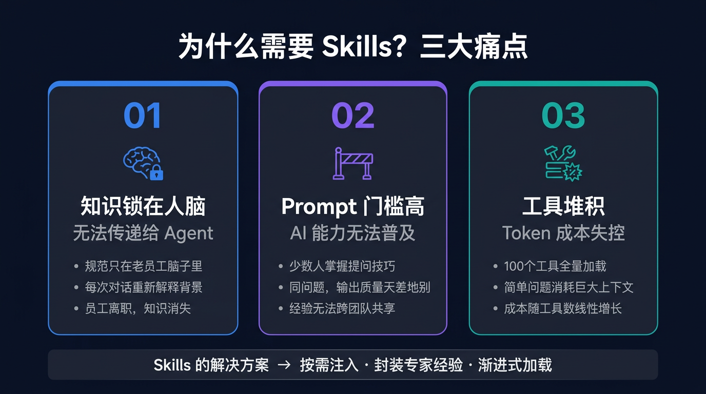

# Agent Skills 技术文档



## 一、什么是 Agent Skills？

**Agent Skills** 是 Anthropic 提出的一种开放标准，已被 Claude Code、Cursor 等主流 AI Agent 产品采用，用于扩展 AI Agent 的能力和专业知识。

简单来说，**Skill 就是一个文件夹**，核心是一个 `SKILL.md` 文件，其余都是可选的增强：

```plaintext
my-skill/
├── SKILL.md          # 必需：指令 + 元数据（告诉 Agent 是什么、怎么做）
├── scripts/          # 可选：可执行脚本
├── references/       # 可选：参考文档
└── assets/           # 可选：模板、资源文件

```

### SKILL.md 的两个组成部分

`SKILL.md` 由 **元数据**（YAML frontmatter）和 **指令**（Markdown 正文）组成：

```yaml
---
name: my-skill
description: 这里描述 Skill 的能力和触发条件    # 元数据
---

# 这里是 Markdown 正文（指令部分）              # 指令

```

#### 元数据字段一览

| 字段 | 必填 | 硬限制 | 推荐长度 | 说明 |
| --- | --- | --- | --- | --- |
| `name` | ✅ | 64 字符 | 3-25 字符 | Skill 标识符 / 斜杠命令名，仅小写字母、数字、连字符 |
| `description` | ✅ | 1024 字符 | 英文 150-500 字符 / 中文 80-250 字 | Agent 靠它判断是否调用（启动时全量加载，越长越费 token） |
| `license` |  | \- | 短标识即可 | 许可协议，如 `MIT`、`Apache-2.0` |
| `allowed-tools` |  | \- | 按需列出 | 安全约束字段，限制 Skill 可使用的工具 |
| `metadata` |  | \- | 总计 < 200 字符 | 键值对，放 author、version、category 等 |

> 注：`author`、`version` 等不是顶层字段，需嵌套在 `metadata:` 内。

**完整元数据示例：**

```yaml
---
name: data-analysis
description: |
  分析用户增长、留存、漏斗等核心指标，生成 SQL 查询和可视化报表。
  Use this skill when the user mentions: 用户增长、新增用户、DAU、MAU、
  留存率、次留/7日留/30日留、转化漏斗、渠道分析、用户分群。
  Do NOT use for: 内容数据分析、收入财务报表、实时监控告警。
license: MIT
allowed-tools: Read, Grep, Glob, Bash
metadata:
  author: "data-team"
  version: "1.2.0"
  category: "analytics"
---

```

#### 指令正文的推荐结构

```plaintext
# Skill 标题

## 概述
1-2 句话说明这个 Skill 做什么（给 Agent 建立全局认知）

## 工作流程
按场景分支，告诉 Agent 遇到不同需求怎么走：
- 场景 A → 执行步骤 1, 2, 3
- 场景 B → 执行步骤 1, 2, 3

## 约束和规则
必须遵守的硬性要求（精简，不要堆砌）

## 输出格式
定义输出的模板或样式

## 参考资料
指向 references/ 目录的链接（详细内容不要写在正文里）

```

#### 四个写作要点

| 要点 | 说明 |
| --- | --- |
| **用祈使句** | 写"用 pdfplumber 提取文本"，不写"你应该用 pdfplumber" |
| **解释 WHY 而不只是 WHAT** | Agent 很聪明，告诉它"为什么这样做"比堆 MUST 更有效 |
| **用示例代替长篇解释** | 一个 Input/Output 示例胜过三段描述 |
| **详细内容放 references/ 和 scripts/** | 正文只留核心指令和引用链接，API 文档、长示例、领域细节都放到子目录 |

**正文长度建议：** 英文 1500-2000 词 / 中文 800-1200 字，均不超过 500 行。正文在激活时注入上下文，每个 token 都跟对话内容竞争窗口空间，中文尤其要控制篇幅（1 字 ≈ 1.5 token）。

---

### Skill 是如何工作的？——渐进式加载


Skills 不是一次性把所有内容塞进上下文，而是用**三层渐进式加载**精准控制 token 消耗：

```plaintext
┌──────────────────────────────────────────────┐
│  第一层：发现（Agent 启动时）                  │
│  动作：加载所有 Skill 的 name + description    │
│  目的：判断哪些 Skill 跟当前任务相关           │
│  消耗：极低（仅元数据，几十个 token）          │
└──────────────────────┬───────────────────────┘
                       ↓ 任务匹配时
┌──────────────────────────────────────────────┐
│  第二层：激活                                  │
│  动作：读取完整的 SKILL.md 内容               │
│  目的：获得详细指令，知道怎么做                │
│  消耗：建议控制在 < 5000 tokens               │
└──────────────────────┬───────────────────────┘
                       ↓ 执行过程中
┌──────────────────────────────────────────────┐
│  第三层：执行                                  │
│  动作：按需加载 scripts/、references/、assets/ │
│  目的：获取更多上下文或运行代码                │
│  消耗：按需，用多少加载多少                    │
└──────────────────────────────────────────────┘

```

这个设计直接解决了"上百个工具全量加载"的问题——**Skill 越多，也不会拖慢启动，不会浪费 token**。

---

## 二、为什么需要 Skills？

### Agent 的局限性

**Agent 智能但不了解你的业务。** 没有 Skill 时，每次对话都要重新解释业务背景：

> **没有 Skill：**用户：帮我写一个用户增长的 SQLAgent：好的，请问用户增长怎么定义？数据在哪个表？用什么维度？用户：新增用户是 first\_visit\_time 在当月的用户，表是 user\_info，维度有渠道、地区、设备类型...（重复解释 5 分钟）

> **有了 Skill：**用户：帮我写一个用户增长的 SQLAgent：（自动加载 data-analysis skill）好的，基于 user\_info 表，按渠道、地区、设备类型统计本月新增用户...



### 三个核心痛点

#### 痛点一：知识锁在人脑，无法传递给 Agent

业务知识散落在每个人脑子里，Agent 每次启动都是一张白纸。

**典型场景：**

*   资深开发知道 Redis 的 Key 命名规范，新人不知道，Agent 也不知道
    
*   每次让 Agent 写代码，都要先解释项目背景、表结构、业务约束
    
*   公司有安全红线，但没有地方告诉 Agent
    

**后果：** 新员工上手慢，老员工反复被打扰；同样的坑反复踩，同样的上下文反复传递。

**Skill 解决：**

```plaintext
知识写进 SKILL.md → 每次对话自动注入 → 一次编写，反复使用

```
---

#### 痛点二：Prompt 门槛高，AI 能力无法普及

会写 Prompt 的人能从 Agent 拿到高质量输出，不会写的人拿到的结果天差地别。

**典型场景：**

*   团队里只有 1-2 个人摸索出了"让 Agent 写出好 SQL"的方式
    
*   其他人照着提问，拿到的结果完全不一样
    
*   最佳 Prompt 存在某人的本地文档里，无法共享
    

**后果：** AI 使用效果严重依赖个人经验，组织层面无法形成统一的高质量标准。

**Skill 解决：**

```plaintext
专家经验 → 封装进 Skill → 所有人安装即用 → 不需要会写 Prompt

```
---

#### 痛点三：工具堆积，Token 成本失控

随着 MCP 工具不断增加，每次 Agent 启动都把所有工具的完整描述塞进上下文，不管这次对话用不用得到。

**典型场景：**

*   团队积累了上百个 MCP 工具
    
*   用户问一句"帮我写个 SQL"，Agent 先加载所有工具的完整 schema
    
*   工具越堆越多，每次对话的启动成本线性增长
    

**后果：** Token 消耗不可控，简单任务和复杂任务消耗相同的启动成本，Context 窗口被无效内容占满，影响输出质量。

**Skill 解决：** 渐进式加载天然解决了这个问题——启动时只加载 name + description（几十个 token），匹配到任务才读完整 SKILL.md，执行中再按需加载脚本和参考文档。**Skill 越多，也不会拖慢启动**。

---

### 一句话总结

> **把知识从人的脑子里搬到 Agent 的上下文里，把专家经验变成人人可用的能力，把无序的工具加载变成按需的精准注入。**

---

## 三、如何创建一个好 Skill？

### 四个核心原则

#### 原则一：description 写给 Agent 看，不是写给人看

description 是 Agent 判断"要不要调用这个 Skill"的唯一依据。Agent 做的是关键词匹配 + 语义理解，所以要用它能解析的方式写，列出用户实际会说的话。

**description 必须包含的要素：**

| # | 要素 | 必须？ | 作用 | 示例 |
| --- | --- | --- | --- | --- |
| 1 | **能力声明** | ✅ 必写 | 告诉 Agent 这个 Skill 能做什么 | `分析用户增长、留存、漏斗等核心指标，生成 SQL 和报表` |
| 2 | **触发条件** | ✅ 必写 | 列出用户实际会说的关键词 | `Use this skill when: "用户增长"、"DAU"、"留存率"...` |
| 3 | **排除边界** | 可选 | 防止与相似 Skill 误触发 | `Do NOT use for: 内容分析、财务报表、实时告警` |

**推荐结构：**

```plaintext
第 1 行：能力声明 —— 这个 Skill 做什么
第 2 行：触发条件 —— 列出用户实际会说的触发短语
第 3 行：排除边界 —— Do NOT use for...（多个相似 Skill 时建议加上）

```

**好的 vs 差的 description：**

```yaml
# ✅ 好：能力清晰 + 触发短语具体
description: |
  分析用户增长、留存、漏斗等核心指标，生成 SQL 查询和可视化报表。
  Use this skill when the user mentions: 用户增长、新增用户、DAU、MAU、
  留存率、次留/7日留/30日留、转化漏斗、渠道分析、用户分群。
  Do NOT use for: 内容数据分析、收入财务报表、实时监控告警。

# ❌ 差：只有模糊的能力声明，没有触发条件，没有边界
description: 数据分析

```

#### 原则二：description 宁可"pushy"一点

写得模糊，Agent 可能匹配不到，Skill 就等于废了。明确告诉 Agent 什么时候该用，**宁可多触发、再调整，也不要漏触发**。

#### 原则三：主文件保持简洁

*   SKILL.md 建议控制在 < 500 行、< 5000 tokens
    
*   详细内容放到 `references/` 目录，SKILL.md 只留核心指令和引用链接
    
*   将内容分层：SKILL.md 放核心指令，references/ 放详细文档，scripts/ 放执行代码——Agent 按需逐层加载
    

#### 原则四：文件引用用相对路径

```markdown
# ✅ 正确
详见 [配置指南](references/config-guide.md)

# ❌ 避免
详见 /Users/xxx/skills/my-skill/references/api.md

```
---

### 三级复杂度示例

根据需求选对应的复杂度，不要过度设计：

| 维度 | ⭐ 最简单 | ⭐⭐ 中等 | ⭐⭐⭐ 完整 |
| --- | --- | --- | --- |
| **文件数量** | 1 | 3+ | 10+ |
| **适用场景** | 清单 / 规范 | 工作流 / 接入指南 | 完整能力包 |
| **上下文加载** | 一次性全量 | 按需加载引用 | 多层渐进式 |
| **维护成本** | 低 | 中 | 高 |

---

#### ⭐ 示例一：最简单的 Skill（仅 SKILL.md）

**场景：** 代码审查清单

```plaintext
code-review/
└── SKILL.md

```
```markdown
---
name: code-review
description: |
  代码审查清单，检查安全漏洞、性能瓶颈、可维护性问题，输出分级报告。
  Use this skill when: code review、审查代码、检查代码质量、提 MR 前检查。
  Do NOT use for: 单元测试编写、代码格式化、依赖升级。
---

# 代码审查清单

## 安全检查
- [ ] SQL 注入风险
- [ ] XSS 漏洞
- [ ] 敏感信息硬编码

## 性能检查
- [ ] N+1 查询问题
- [ ] 内存泄漏风险

## 输出格式
- 严重问题（必须修复）
- 建议改进（推荐优化）
- 值得肯定（好的实践）

```
---

#### ⭐⭐ 示例二：带参考文档的 Skill

**场景：** 内部中间件接入指南

```plaintext
middleware-guide/
├── SKILL.md
└── references/
    ├── config-center.md
    ├── redis-usage.md
    └── message-queue.md

```
```markdown
---
name: middleware-guide
description: |
  内部中间件接入指南，覆盖配置中心、Redis 缓存、消息队列。
  Use this skill when: 接入中间件、配置中心使用、Redis Key 规范、MQ Topic、缓存策略。
  Do NOT use for: 数据库 DDL 变更、网关路由配置、监控告警设置。
---

# 中间件接入指南

### 配置中心
- 环境隔离：dev / staging / prod
- 详见 [配置中心指南](references/config-center.md)

### Redis 缓存
- Key 命名规范：`业务名:模块名:标识`
- 详见 [Redis 使用指南](references/redis-usage.md)

### 消息队列
- Topic 命名：`业务名_模块名_事件类型`
- 详见 [消息队列接入指南](references/message-queue.md)

```
---

#### ⭐⭐⭐ 示例三：完整的 Skill（含脚本和多层参考）

**场景：** 数据分析工作流

```plaintext
data-analysis/
├── SKILL.md
├── references/
│   ├── sql-templates/
│   │   ├── user-growth.md
│   │   └── retention.md
│   └── data-sources.md
└── scripts/
    └── validate-sql.py

```
```markdown
---
name: data-analysis
description: |
  分析用户增长、留存、漏斗等核心指标，生成 SQL 查询和可视化报表。
  Use this skill when: 用户增长、新增用户、DAU、MAU、留存率、转化漏斗、渠道分析。
  Do NOT use for: 内容数据分析、收入财务报表、实时监控告警。
---

# 数据分析工作流

## 分析模式

| 模式 | 说明 | 模板 |
|------|------|------|
| 用户增长 | 新增、活跃、回访 | [user-growth.md](references/sql-templates/user-growth.md) |
| 留存分析 | 次日/7日/30日 | [retention.md](references/sql-templates/retention.md) |

## 执行流程
1. 确认分析目标和时间范围
2. 选择对应的 SQL 模板
3. 运行 `scripts/validate-sql.py` 校验语法
4. 执行查询并格式化输出

详见 [数据源说明](references/data-sources.md)

```
---

## 四、skill-creator：让 AI 帮你写 Skill


手动写 Skill 有一定成本：怎么措辞 description 才能准确触发？指令怎么写 Agent 才能理解？

**skill-creator** 是 Anthropic 官方提供的一个元技能（meta-skill），专门用于**创建和优化其他 Skill**。

> 官方仓库：https://github.com/anthropics/skills/tree/main/skills

### 它能做什么？

| 能力 | 说明 |
| --- | --- |
| **从零生成 Skill** | 描述你的需求，自动生成完整的 SKILL.md |
| **优化已有 Skill** | 对现有 Skill 进行迭代改进，提升触发准确性 |
| **跑 eval 测试效果** | 验证 Skill 在真实场景下是否按预期触发和执行 |
| **生成高质量 description** | 自动生成精准的触发描述，避免漏触发或误触发 |

### 使用方式

在 Claude Code 中直接输入：

```plaintext
/skill-creator

```

或者描述你的需求，Agent 会自动识别并调用 skill-creator：

```plaintext
帮我创建一个代码审查的 Skill

```

### 一句话定位

> **普通 Skill 扩展 Agent 的业务能力，skill-creator 扩展你写 Skill 的能力。**

---

## 五、快速上手指南

### 安装 Skill

```bash
# 方式一：从 GitHub 安装
claude install-skill https://github.com/user/my-skill

# 方式二：本地安装（开发调试用）
# 将 Skill 文件夹放到项目的 .claude/skills/ 目录下即可

```

### 创建你的第一个 Skill

1.  在项目中创建 `.claude/skills/my-skill/` 目录
    
2.  创建 `SKILL.md` 文件，填写元数据和指令
    
3.  启动 Claude Code，输入触发关键词测试是否生效
    
4.  根据实际效果迭代 description 和指令内容
    

### Skill 开发检查清单

*   [ ] 
    
*   [ ] 
    
*   [ ] 正文是否控制在 500 行以内
    
*   [ ] 详细内容是否已拆分到 
    
*   [ ] 文件引用是否使用相对路径
    
*   [ ] 是否在真实场景下测试过触发和执行效果