> Paper: [https://arxiv.org/abs/2511.20857](https://arxiv.org/abs/2511.20857)
> Authors: Wei et al., 2025, Google DeepMind & UIUC

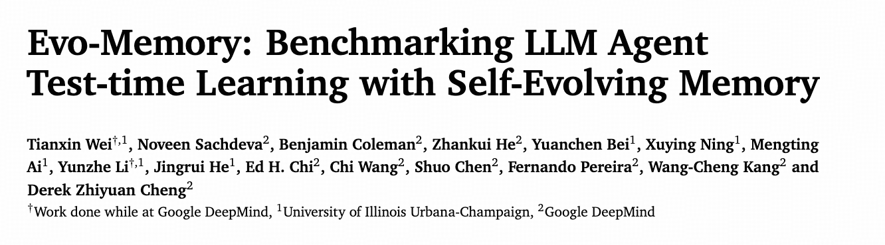

## 1. 核心价值

### 1.1 无需训练的持续进化框架

**ReMem (Reasoning, Acting, and Memory refinement)** 是一个无需更新模型参数（Training-free）、基于 Prompt 工程的 **测试时进化（Test-time Evolution）** 框架。

*   **工程定义**：它不是一套全新的底层架构，而是现有 Memory 系统的 **升级**。

*   **核心收益**：

    1.  **零训练成本**：完全依赖上下文学习（In-Context Learning），无需微调（Fine-tuning）。

    2.  **抗噪能力**：解决了传统 RAG "只存不洗"导致的记忆污染问题，能从失败中吸取教训。

    3.  **越用越强**：随着任务流的推进，Agent 的解决问题能力会持续提升（Test-time Learning）。

### 1.2 落地场景：智能客服/AI助教 Agent 项目 (Dify 集成方案)

**业务背景**：基于 Dify 搭建的 AI 助教/客服，负责处理重复性高但细节有差异的用户咨询。 **当前痛点**：

*   **经验断层**：高转化话术无法自动沉淀。

**ReMem 解决方案流程**：

1.  **输入**：用户提出异议（如"太贵了"）。

2.  **检索 (Retrieve)**：从向量库召回 Top-K 历史经验。

3.  **决策循环 (The ReMem Loop)**：

    *   **Refine (运行时去噪)**：识别并剔除无关的噪音经验。

    *   **Think (推理)**：分析成功案例，提取"共情+价值锚定"策略。

    *   **Act (执行)**：生成高情商回复。

4.  **演化 (Evolve)**：对话结束后，将对话交互提取新的经验策略，更新记忆库。

### 1.3 范式革新：从"教 AI 做事"到"让 AI 自学"

这篇论文没有试图去动哪怕一个模型参数，却找到了一条新路，赋予模型持续学习的能力。

它向整个行业提出了一个新可能：**一个被冻结的 LLM 大脑，能够通过不断反思和重构自己的记忆，表现得像是一个被训练过的模型。**

## 2. 现存问题：为什么现在的 RAG 不好用？

想象一下你正在和最信任的AI助手对话。昨天，它完美地理解了你项目的复杂需求，并为你提供了精准的建议。但今天，当你问它同样的问题时，它却从头开始，仿佛你们是第一次见面。为什么？答案很简单：**它没有真正的"记忆"。**

### 现状 vs. 问题

*   **现状 (Status Quo)**: 现有的记忆系统大多是 **Static Conversational Context**（静态对话上下文）。比如 RAG (检索增强生成)，往往只是被动地检索"事实"(Facts)字典。

    > **"Agents remember what was said, but not what was learned."** _(Agent 记住了说过的话，但没记住学到的经验。)_

*   **举例 --- 一元二次方程**:

    *   **Conversational Recall (静态回忆)**: 做数学题时，Agent 记住了"上次这道题答案是 5"。本质是 Fact Retrieval (查事实)。

    *   **Experience Reuse (动态复用)**: Agent 应该记住"解这类题需要用求根公式"。这叫 Strategy Abstraction (抽象策略)，智能举一反三。

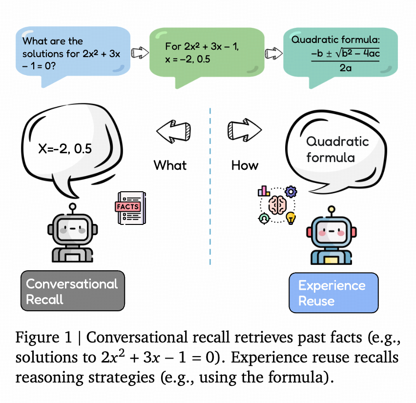

> Benchmarking how LLMs not only **store and recall** but also **evolve, reorganize, and reuse**.

---

## 3. 核心方法

本章首先建立了一个通用的记忆代理框架，然后介绍了基线方法 ExpRAG，最后详细阐述了核心方法 ReMem。

### 3.1 通用框架 (General Formulation)

作者首先将所有记忆增强型 Agent 形式化为一个四元组 $(F, U, R, C)$：

*   **F (Base LLM)**: 基础大模型（大脑）。

*   **U (Update Pipeline)**: 记忆更新管道（怎么存）。

*   **R (Retrieval Module)**: 检索模块（怎么查）。

*   **C (Context Construction)**: 上下文构建机制（怎么拼 Prompt）。

基于此，一个标准的带记忆模块Agent会遵循 **Search-Synthesis-Evolve** 步骤：

### 核心公式与流程

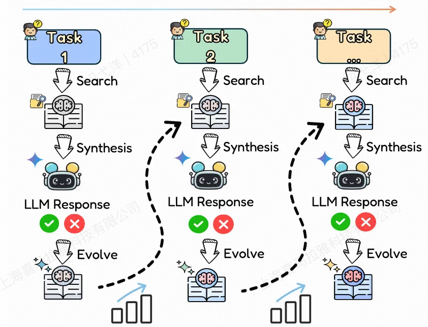

1.  **Search (检索)**:

    $R\_t = \mathcal{R}(M\_t, x\_t)$

    *   _解释_：根据当前输入 $x\_t$ 和当前记忆库 $M\_t$，检索出相关记忆 $R\_t$。

2.  **Synthesis (合成)**:

    $\tilde{C}\_t = \mathcal{C}(x\_t, R\_t)$

    $\hat{y}\_t = \mathcal{F}(\tilde{C}\_t)$

    *   _解释_：把输入和记忆拼成 Prompt $\tilde{C}\_t$，然后喂给 LLM 得到输出 $\hat{y}\_t$。

    *   _关键点_：**"Restructures... into a concise working context"**。不仅仅是拼接，还包括摘要、重组。

3.  **Evolve (演化)**:

    $m\_t = h(x\_t, \hat{y}\_t, f\_t)$

    $M\_{t+1} = \mathcal{U}(M\_t, m\_t)$

    *   _解释_：任务做完后，把 (输入, 输出, 反馈) 打包成一条新经验 $m\_t$，然后更新进记忆库 $M\_t$。

    *   _意义_：这是实现 **Continual Improvement** 的关键一步。

---

### 3.2 基线方法：ExpRAG (The Baseline)

**ExpRAG** 是上述框架的最简实现，也是本文的 Baseline。

*   **机制**: 基于 **In-Context Learning (ICL)** 原理。

    *   流程：Retrieve Top-K 相似历史 -> 拼接 Prompt -> 推理 -> **直接追加 (Direct Append)** 到记忆库。

    *   公式: $M\_{t+1} = M\_t \cup \{(x\_t, \hat{y}\_t, f\_t)\}$

*   **深度评价**:

    *   ✅ **优点**: 简单有效，利用了大模型的上下文学习能力。

    *   ❌ **缺点**: 缺乏迭代推理。它**只加不减**，记忆库会迅速膨胀并积累噪音。它只是堆砌经验，而没有进行深度的反思或精炼 (Adaptive Refinement)。

---

### 3.3 核心创新：ReMem

为了解决 ExpRAG 记忆臃肿和被动的问题，作者提出了 **ReMem**。

> We propose ReMem, a simple yet effective framework that unifies reasoning, action, and memory refinement within a single decision loop.

#### 3.3.1. 核心理念：引入第三维度

*   **传统方法 (ReAct)**: 将记忆视为 **Static Context (静态背景)**。

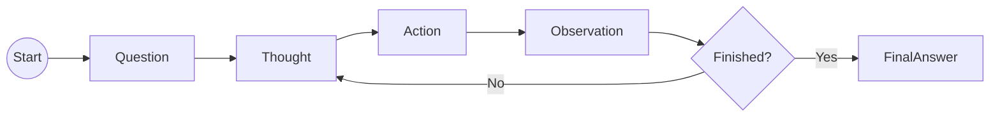
```mermaid
flowchart LR
    Start((Start)) --> Question
    Question --> Thought
    Thought --> Action
    Action --> Observation
    Observation --> Check{Finished?}

    Check -- No --> Thought
    Check -- Yes --> FinalAnswer
```

*   **ReMem**: 引入了 **Memory Reasoning (记忆推理)** 作为第三维度。

    *   _意义_: Agent 不再是被动查阅，而是能主动评估、重组和演化记忆。

#### 3.3.2. 设计：

##### A、利用 MDP 实现'即时决策'。

作者将记忆管理建模为一个 **MDP (马尔可夫决策过程)**。

$s^n\_t = (x\_t, M\_t, o^{1:n-1}\_t)$

在 ReMem 中，Agent 做决定时，只需要关注当前输入、记忆和推理轨迹，通过这种建模，我们把一个复杂的、漫长的推理任务，拆解成了一个个清晰的、基于当下的微观选择。

##### B、嵌套决策循环 (Nested Decision Loop)

ReMem 设计了一个精细的双层结构。

$\text{Task} \xrightarrow{\text{包含}} \{ \text{Step}\_t \} \xrightarrow{\text{包含}} \{ \text{Operation}^n\_t \}$

*   一个 **Task** 包含多个 **Step**。

*   一个 **Step** 包含多个 **Operation，**Operation 的选择与流转，是完全遵循马尔可夫决策过程的。

#### 3.3.3. 三大核心动作 (Action Space)

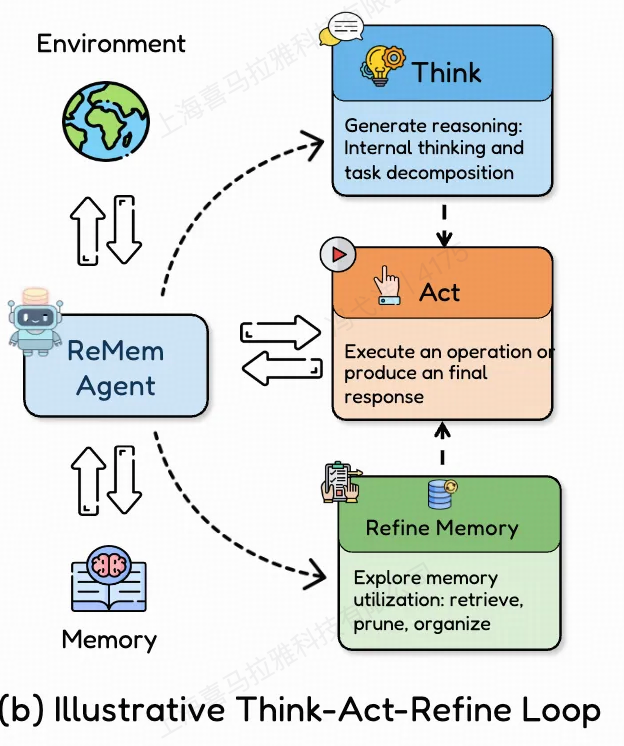

在每一个 Operation 内部，Agent 都要从以下三个动作中选择 $a^n\_t$：

1.  **Think (思考)**:

    *   产生新的推理步骤 $o^n\_t$，让轨迹变长。

    *   _作用_: 拆解任务，为决策做铺垫。

2.  **Refine (精炼 - 核心创新)**:

    *   **定义**: 执行 **Meta-reasoning (元推理)**，直接改变当前的记忆状态 ($M\_t \rightarrow M'\_t$)。

    *   **具体操作**:

        *   ✅ **Exploiting (利用)**: 识别并强化有用的经验。

        *   ✂️ **Pruning (剪枝)**: 识别并删除误导性的噪音 (Noise)。

        *   🗂️ **Reorganizing (重组)**: 将零散的记忆整理成结构化的规则。

    *   _目的_: To better support future reasoning and action. (为了更好地支持未来的推理和行动)。

    *   _比喻_: ExpRAG 像是一个从不整理笔记的学生；ReMem 则是边学边整理，把没用的草稿扔掉，把核心公式提炼到"错题本"上。

3.  **Act (行动)**:

    *   执行外部环境交互。

    *   **关键机制 (Termination Condition)**:

        > **"The step terminates once an Act operation is selected."**

    *   在一个 Step 内，Agent 可以进行**多轮 (Multiple Rounds)** 的 Think 和 Refine，直到它觉得准备好了，选择 Act。一旦 Act，当前 Step 结束，进入下一步 $t+1$。

##### Case Study:

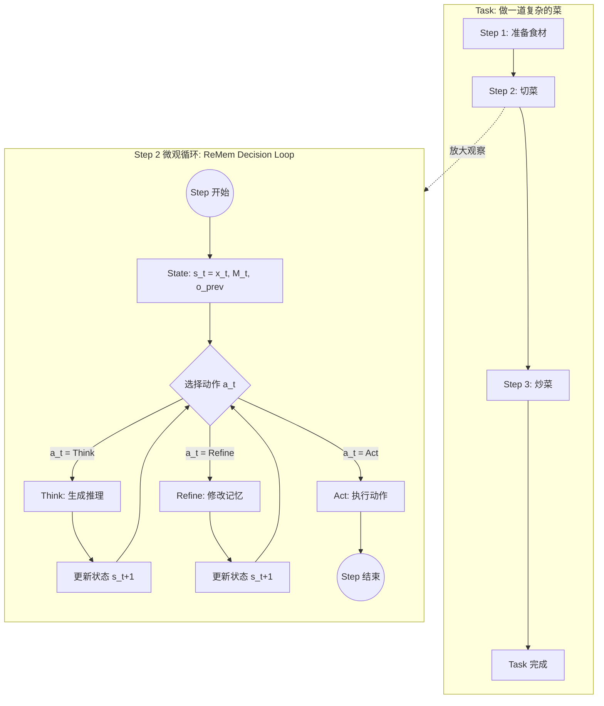
```mermaid
flowchart TD
    subgraph Task_Level [Task: 做一道复杂的菜]
        direction LR
        Step1[Step 1: 准备食材] --> Step2[Step 2: 切菜]
        Step2 --> Step3[Step 3: 炒菜]
        Step3 --> TaskEnd[Task 完成]
    end

    subgraph Step_Micro [Step 2 微观循环: ReMem Decision Loop]
        direction TB
        StartStep((Step 开始)) --> StateInit[State: s_t = x_t, M_t, o_prev]
        StateInit --> Decision{选择动作 a_t}

        Decision -->|a_t = Think| Think[Think: 生成推理]
        Think --> StateUpdate1[更新状态 s_t+1]
        StateUpdate1 --> Decision

        Decision -->|a_t = Refine| Refine[Refine: 修改记忆]
        Refine --> StateUpdate2[更新状态 s_t+1]
        StateUpdate2 --> Decision

        Decision -->|a_t = Act| Act[Act: 执行动作]
        Act --> EndStep((Step 结束))
    end

    Step2 -.->|放大观察| Step_Micro
```

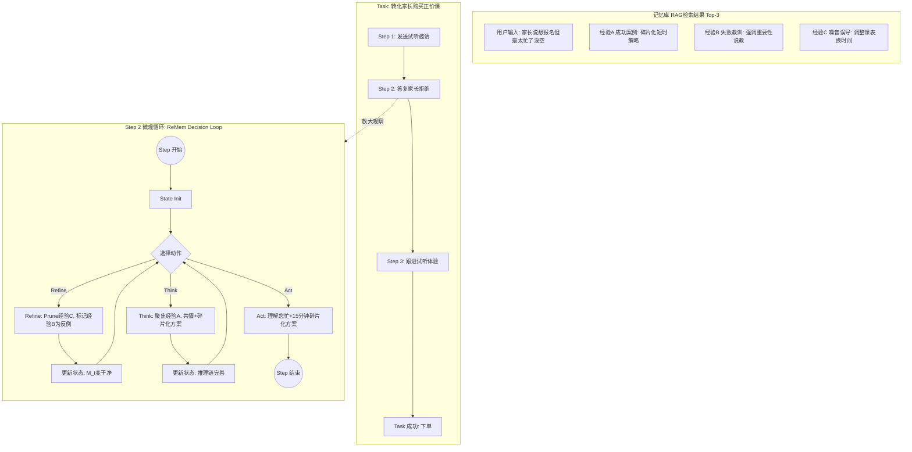
```mermaid
flowchart TD
    subgraph Memory_DB [记忆库 RAG检索结果 Top-3]
        direction TB
        Query[用户输入: 家长说想报名但是太忙了没空]
        ExpA[经验A 成功案例: 碎片化短时策略]
        ExpB[经验B 失败教训: 强调重要性说教]
        ExpC[经验C 噪音误导: 调整课表换时间]
    end

    subgraph Task_Level [Task: 转化家长购买正价课]
        direction LR
        Step1[Step 1: 发送试听邀请] --> Step2[Step 2: 答复家长拒绝]
        Step2 --> Step3[Step 3: 跟进试听体验]
        Step3 --> TaskEnd[Task 成功: 下单]
    end

    subgraph Step_Micro [Step 2 微观循环: ReMem Decision Loop]
        direction TB

        StartStep((Step 开始)) --> StateInit[State Init]
        StateInit --> Decision{选择动作}

        Decision -->|Refine| Refine[Refine: Prune经验C, 标记经验B为反例]
        Refine --> StateUpdate2[更新状态: M_t变干净]
        StateUpdate2 --> Decision

        Decision -->|Think| Think[Think: 聚焦经验A, 共情+碎片化方案]
        Think --> StateUpdate1[更新状态: 推理链完善]
        StateUpdate1 --> Decision

        Decision -->|Act| Act[Act: 理解您忙+15分钟碎片化方案]
        Act --> EndStep((Step 结束))
    end

    Step2 -.->|放大观察| Step_Micro
```

这就是 ReMem 强大的原因：它在每一次真正执行之前，都先完成了一次Memory的自迭代。

##### 落地：

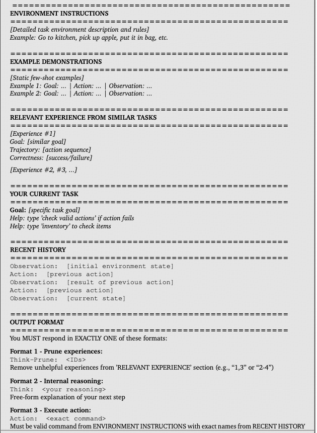

[《ReMem Prompt》](https://alidocs.dingtalk.com/i/nodes/KGZLxjv9VG3RZlMvUxA1BeYvV6EDybno)

#### 3.3.4. 从 Passive 到 Adaptive

> **原文**: "This unified formulation expands the action space of ReAct-style agents by introducing an explicit memory reasoning mechanism."

*   **ReAct 的扩展**: ReAct 只有 {Think, Act}，ReMem 增加了 {Refine}。

*   **范式转移**: 记忆从 **Passive Context (被动上下文)** 变成了与推理 **Real-time Interaction (实时交互)** 的 **Adaptive Component (自适应组件)**。

---

## 4. Evo-Memory 基准 & 关键实验结论

实验结果证明了 ReMem 具有显著的 **Test-time Learning (测试时学习)** 能力。

### 4.1：Evo-Memory 基准

作者制定了新的测试基准——**Evo-Memory Benchmark**。

#### 4.1.1 核心理念：From Static to Streaming

*   **旧范式 (Static i.i.d.)**:

    *   传统的评估（如 MMLU、GSM8K）都基于**独立同分布 (i.i.d.)** 假设。

    *   每道题都是孤立的，做第1题的经验无法迁移到第2题。

*   **新范式 (Streaming Evolution)**:

    *   现实世界是**流式 (Streaming)** 的。类似的问题会反复出现，我们必须从失败中吸取教训，复用成功的模式。

    *   Evo-Memory 将静态数据集重组为**具有时序依赖的任务流 (Sequential Task Streams)**。

    *   **设计逻辑**: _"Earlier tasks provide essential information or strategies for later ones."_ (前面的任务是后面的铺垫)。

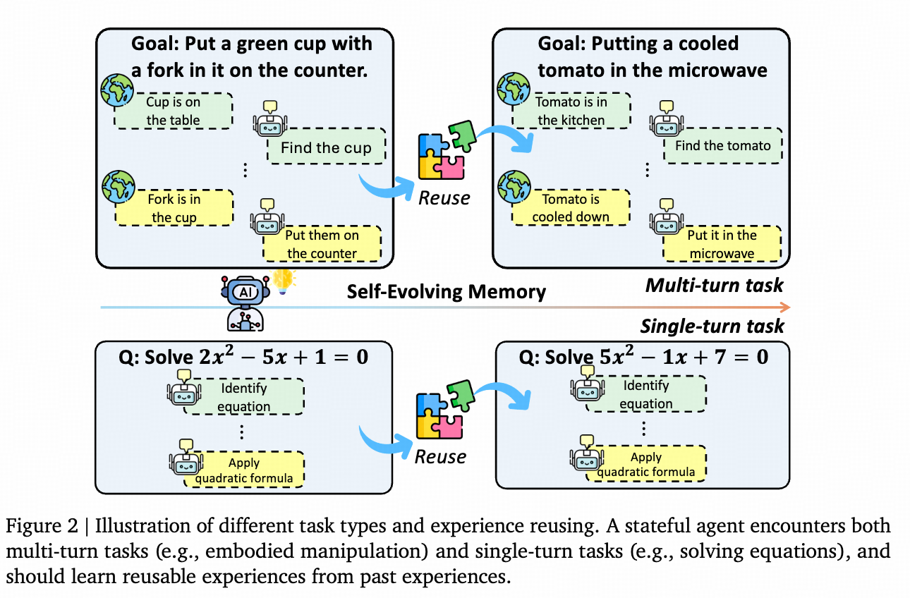

#### 4.1.2 数据集：全方位的测试场 (Diverse Datasets)

为了全面评估这种能力，Evo-Memory 精选了 **10 个** 具有代表性的数据集，覆盖了从"做题"到"做事"的广泛场景。

##### A. Single-turn Reasoning (单轮推理)

_主要考察：事实回忆 (Factual Recall) 与 逻辑推理 (Reasoning)_

| 数据集名称 | 核心特点 | 考察能力 | 备注 |
| --- | --- | --- | --- |
| **MMLU-Pro** | MMLU 增强版 | 广泛学科知识 | 过滤泄漏，更难更严谨 |
| **GPQA-Diamond** | 研究生级科学难题 | **事实推理** | "Google-proof" 难搜题 |
| **AIME-24/25** | 美国数学邀请赛 | **数学能力** | 严格精确匹配，含最新题 |
| **ToolBench** | 真实 API 调用 | **工具使用** | 识别意图并配置参数 |

##### B. Multi-turn Goal-oriented (多轮任务导向)

_主要考察：长程推理 (Long-horizon Reasoning) 与 序列决策 (Sequential Decision-making)_

| 数据集名称 | 场景设定 | 任务类型 | 典型示例 |
| --- | --- | --- | --- |
| **AlfWorld** | 家庭环境 | **指令跟随** | "洗苹果并放进微波炉" |
| **BabyAI** | 网格世界 | **导航与组合** | "开红门捡蓝球" |
| **ScienceWorld** | 科学实验室 | **科学实验** | "测物体体积" |
| **Jericho** | 文本游戏 | **探索与解谜** | 互动小说 |
| **PDDL Tasks** | 符号规划 | **符号规划** | 搬积木等经典规划 |

#### 4.1.3 评估维度：不仅要对，还要进化 (Evaluation Metrics)

既然是测"学习能力"，我们就不能只看分数。Evo-Memory 引入了新的评估维度：

1. Answer Accuracy (回答准确率): 衡量模型在单轮任务中是否产生正确的输出。

2. Success Rate & Progress Rate (成功率与进度率): 评估多轮任务中的目标完成情况。（注：Success Rate 是"做完了没"，Progress Rate 是"做到了哪一步"）。

3. Step Efficiency (步骤效率): 追踪达成目标所需的步数，反映推理的简洁性 (Conciseness)。（注：步数越少越好，说明没走弯路）。

4. Sequence Robustness (序列鲁棒性): 测试在不同任务顺序下，性能是否保持稳定。

### 4.2 实验表现

#### 4.2.1. 整体表现 (RQ1)

下面两表代表单轮和多轮设置下的结果。总体而言，Evo-Memory 证明了自演化记忆架构能提供持续的改进。

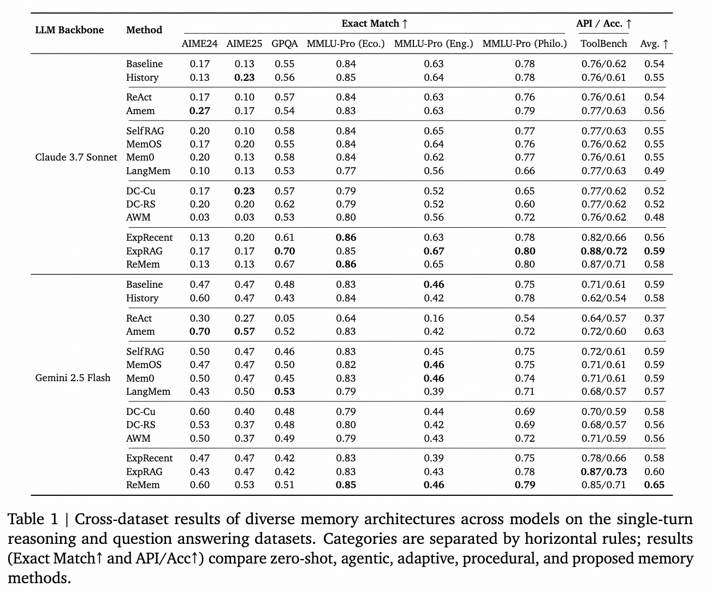

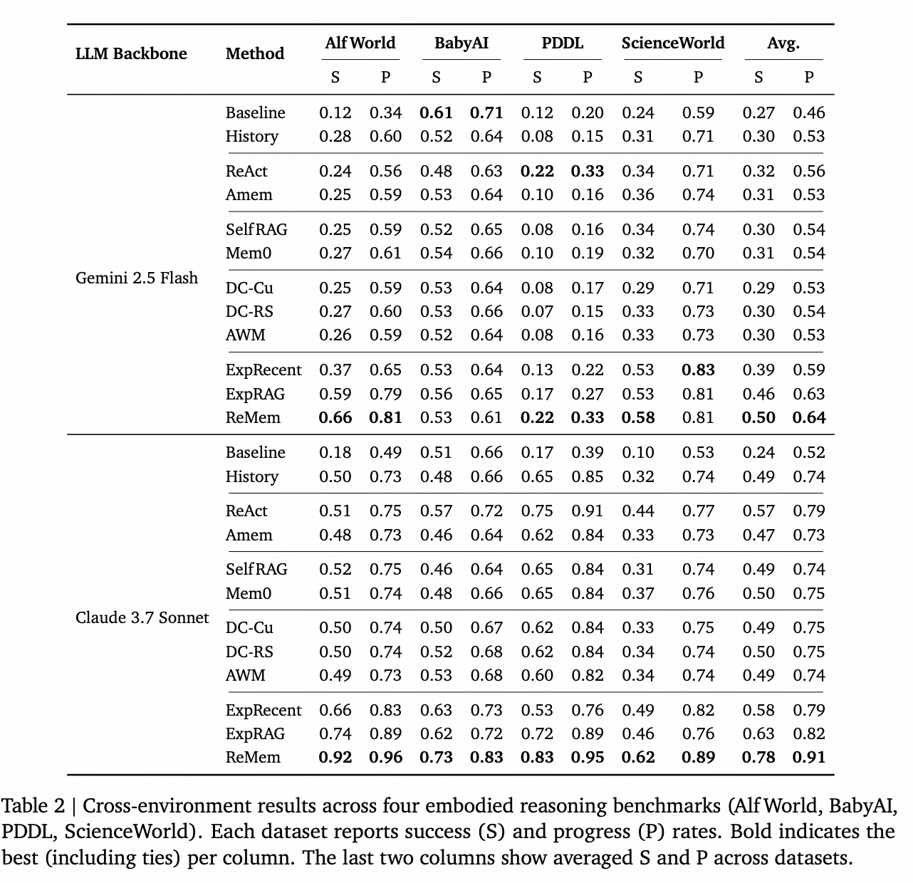

_Exact Match (精确匹配率):_ _比如 AIME24 下面的 0.17，意思是做对了 17% 的题目（答案必须完全一致）。_

_API Match (或 Pass Rate) - 斜杠前面的数字，Agent 选对工具了吗？参数填对了吗？_

_Accuracy (或 Win Rate) - 斜杠后面的数字，最终给用户的答案对不对？_

_S (Success Rate - 成功率):_ _任务彻底完成了吗？(1=完成, 0=失败)。_

_P (Progress Rate - 进度率):_ _完成了百分之多少的子目标？例子: 任务分 4 步，你完成了前 3 步然后挂了，S=0，但 P=0.75。_

*   在 **Gemini-2.5** 和 **Claude-3.5** 等模型上，ReMem 在单轮推理 (Single-turn) 和多轮决策 (Multi-turn) 任务中均**显著超越** Baseline。

*   尤其在多轮设置中的性能增益显著更大，随着任务战线拉长，持续适应的价值越来越大。

#### 4.2.2. 提效分析 (RQ2)

为什么 ReMem 在有的任务上提升巨大，有的就一般呢？我们发现了两个有趣的规律。

*   任务相似度

    ReMem 的性能提升与数据集内部的任务相似度 (Task Similarity) 呈现强正相关（在 Gemini 2.5 Flash 上 Pearson相关系数 $r = 0.717$，在 Claude 3.7 Sonnet 上 $r = 0.563$）。

    具有较高 Embedding 聚类比率的任务（如 PDDL 和 AlfWorld）收益更大，这表明重复出现的任务结构有利于记忆的复用和泛化。

    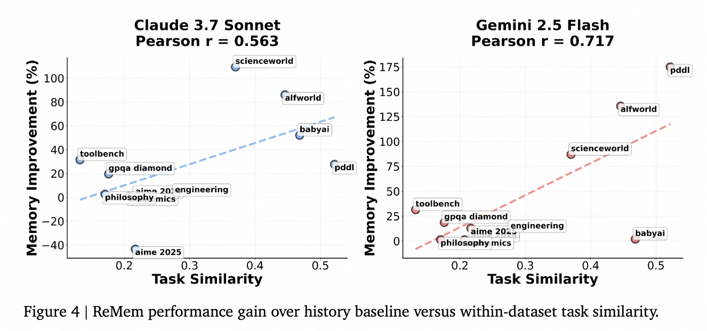

*   步骤效率

ReMem 能够显著减少完成任务所需的步数。

总体而言，持续的精炼 (Continual Refinement) 不仅提高了准确率，还使推理过程更加聚焦和高效 (Focused and Efficient)。

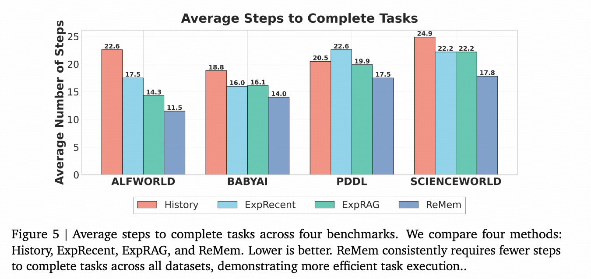

#### 4.2.3. 难度顺序与鲁棒性 (RQ3)

本表测试了基于记忆的 Agent 如何适应任务难度的变化。

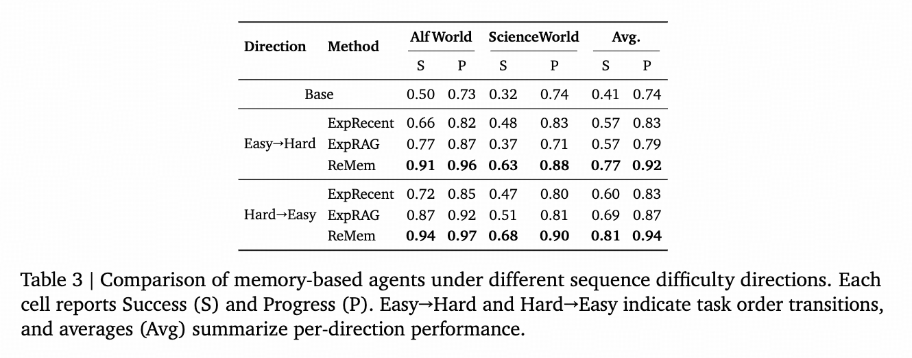

*   **Hard -> Easy**: 当先做难题、后做简单题时，ReMem 表现极佳。这说明先攻克难关，积累的高质量、复杂的经验 (High-quality, complex experiences)，在降维打击做简单任务时非常有效。

*   **Easy -> Hard**: 即使顺序反过来，ReMem 也表现出极强的稳定性，而其他方法容易崩盘，这意味着它们在简单任务中积累的经验无法很好地泛化到困难任务。

#### 4.2.4. 抗噪能力 (RQ4)

表 4 评估了当记忆中同时存储了**成功任务和失败任务的**历史记录或经验时，Agent 的表现。

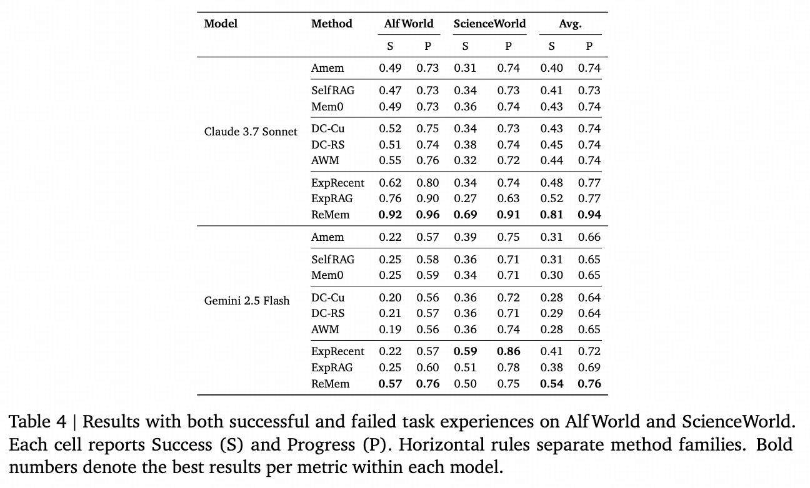

*   **其他方法 (Baselines)**: 当混入失败记录时，性能**显著下降**。因为它们检索到失败的案例，可能会误导模型重蹈覆辙。

*   **ReMem**:

    *   在包含失败记录的情况下，依然保持了**最高的成功率**。

    *   **Why?**: 因为 ReMem 有 `**Think-Prune**` **(剪枝)** 和 `**Refine**` **(重构)** 机制。它能够识别出哪些是"失败的教训"并加以利用，或者在检索后将其过滤掉/修正，而不是盲目模仿。

*   **核心洞察**: **Selective Utilization (选择性利用)**。真正的智能不是只记录成功，而是能从失败中吸取教训并在此后避免它。ReMem 具备这种"去伪存真"的能力。

#### 4.2.5. 学习曲线 (RQ5)

图 6 展示了在四个交互环境中，随着任务推进的累积准确率 (Cumulative Accuracy) 变化。

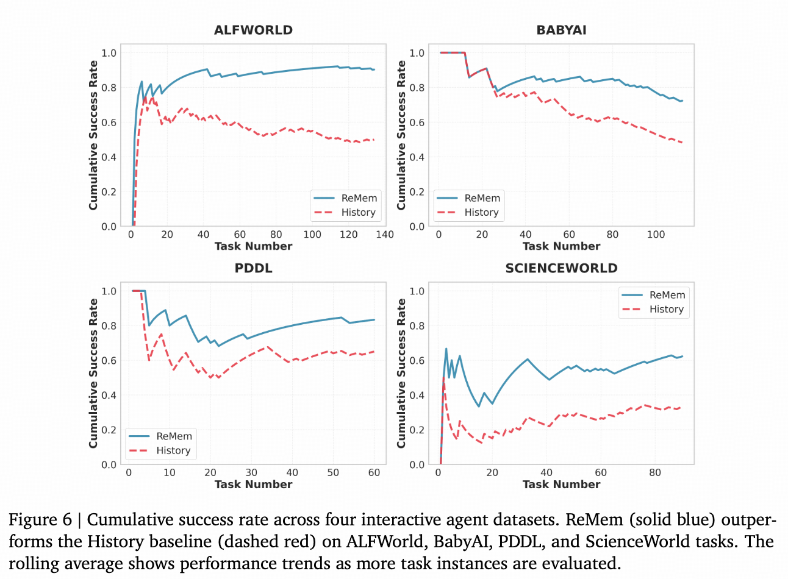

1. AlfWorld (左上) & ScienceWorld (右下) —— 稳中有升 (典型的 Learning)

现象: 曲线总体是往上走的。特别是 AlfWorld，ReMem 从 0.7 冲到了 0.9 左右。

原因: 这类任务有很强的可复用性 (Reusability)。比如 AlfWorld 里"用微波炉热苹果"学会了，下次"用微波炉热土豆"就能直接套用。Agent 越做越熟练。

2. PDDL (左下) & BabyAI (右上) —— 先降后稳/微降

现象: BabyAI: 一开始是 1.0 (全对)，然后慢慢掉下来。PDDL: 波动很大，有些下降趋势。

原因: 任务难度递增: 很多数据集（如 BabyAI）是按难度排序的，或者后面的任务越来越复杂。一开始的任务很简单（如"向前走一步"），所以成功率是 100%。后面任务变难了（如"开红门找蓝钥匙"），成功率自然会下降。

虽然题目变难了，ReMem 还是靠着经验复用"扛住了"难度，比只会死记硬背的 Baseline 强得多。

*   趋势: 在所有环境中，ReMem 始终随着时间推移实现了更快的适应 (Faster Adaptation) 和 更稳定的保持 (More Stable Retention)。

*   结论: 这些结果突出了持续的反思使 ReMem 能够在长任务序列中维持高性能，展示了其在测试时学习中的鲁棒性。

---

## 5. 总结与工程落地建议

### 5.1 总结

Evo-Memory 重新定义了 Agent 的学习方式：

*   **过去**: Training -> Frozen Model -> Inference

*   **现在**: Inference + Memory Evolution = Continuous Learning 它证明了，**"怎么记" (Refine/Prune) 比 "记什么" (Storage) 更重要。**

### 5.2 Dify 工程落地

参照 ReAct 范式将 ReMem 集成到现有的 Dify Agent节点里：

**dify 改造:**

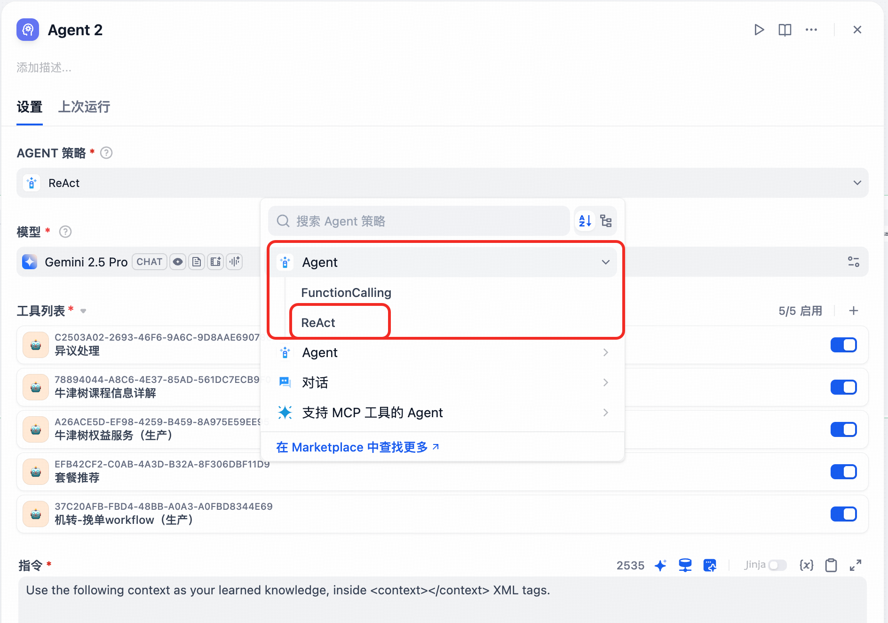

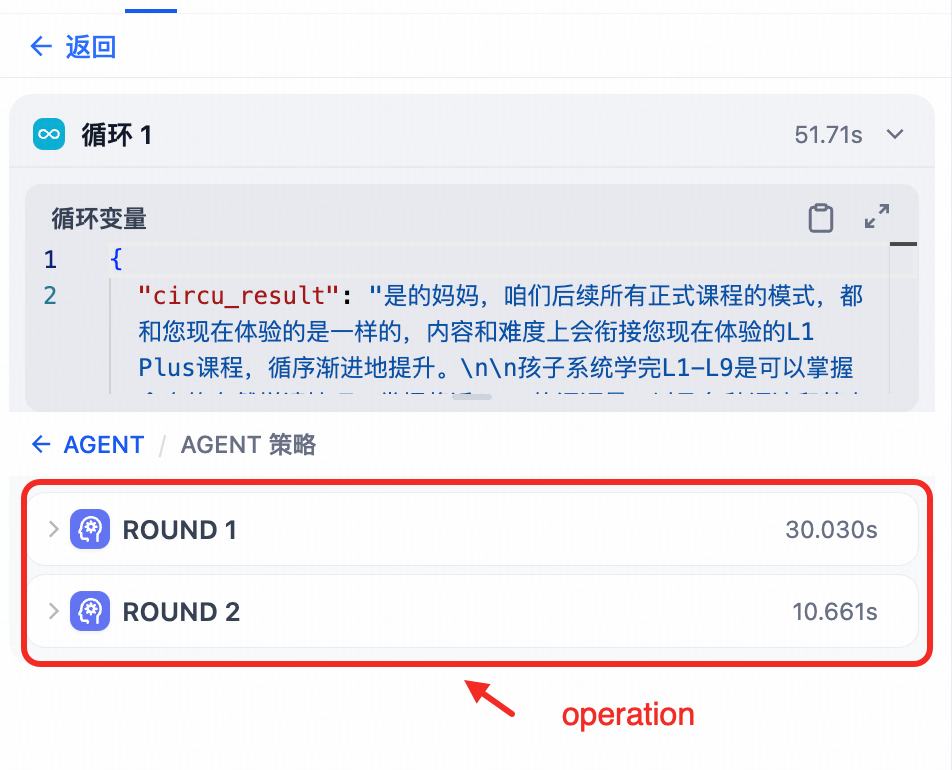
